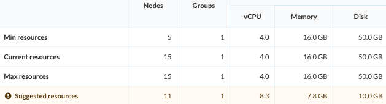
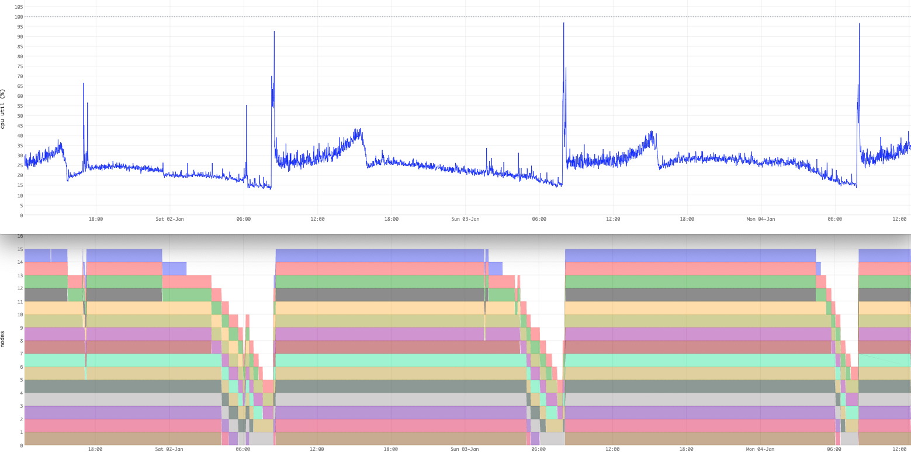

---
# Copyright Verizon Media. All rights reserved.
title: Autoscale
---

Refer to [services.xml](reference/services) for node and resource configuration details.

Autoscale is for two things:
* Optimize the node resources
* Optimize the number of nodes

When deploying a new application, or large changes to an application's config,
it is hard to find the optimum in advance.
Therefore, deploy with more-than-enough capacity, and check the Resource console - example:



A rule of thumb is, find the optimal node configuration first, then optimize for daily variations.
Above, Vespa suggests using fewer, but stronger, nodes.
Normally, teams run a few cycles of optimizing node resources and the application configuration in concert -
see [benchmarking and sizing](benchmarking).
This can be done with or without autoscaling enabled.

Using node count autoscaling is useful to analyze daily/weekly variations, the console outputs details - example: 

```
2021-01-03 05:05Z: From  9 nodes with vcpu=4 memory=16Gb disk=50Gb to  8 nodes with vcpu=4 memory=16Gb disk=50Gb
2021-01-03 05:35Z: From  8 nodes with vcpu=4 memory=16Gb disk=50Gb to  7 nodes with vcpu=4 memory=16Gb disk=50Gb
2021-01-03 06:05Z: From  7 nodes with vcpu=4 memory=16Gb disk=50Gb to  6 nodes with vcpu=4 memory=16Gb disk=50Gb
2021-01-03 06:30Z: From  6 nodes with vcpu=4 memory=16Gb disk=50Gb to  5 nodes with vcpu=4 memory=16Gb disk=50Gb
2021-01-03 06:55Z: From  5 nodes with vcpu=4 memory=16Gb disk=50Gb to  8 nodes with vcpu=4 memory=16Gb disk=50Gb
2021-01-03 07:05Z: From  8 nodes with vcpu=4 memory=16Gb disk=50Gb to 15 nodes with vcpu=4 memory=16Gb disk=50Gb
2021-01-04 03:30Z: From 15 nodes with vcpu=4 memory=16Gb disk=50Gb to 14 nodes with vcpu=4 memory=16Gb disk=50Gb
```

With this, it is easy to correlate latencies with resources allocated, for further optimizations and alert settings.
It can be a good idea to make sure the cluster does not autoscale to the upper limit during normal operations,
as this means it is close to saturation.
It is also a good idea to experiment with what is a practical lower bound,
to find the cost/performance sweet spot. 


## Resource tradeoffs
The _Suggested resources_ in the console tries to optimize for cost,
but there are other considerations, too.

* Making changes to resources/nodes is easy and safe, and one of Vespa Cloud's strength.
  We advise you make controlled changes and observe effect on latencies, data migration and cost.
  Everything is automated, just submit a new application package.
  This is useful learning when later needed during load peaks and capacity requirement changes.
* Node resources cannot be chosen freely, CPU/Memory often comes in increments of x 2.
  Try to make sure that the resource configuration is a good fit.
* CPU is the most expensive component, optimize for this for most applications
* Having very few nodes means larger changes in capacity when nodes stop, say for upgrade.
  4-5 nodes minimum is a good rule of thumb.
  Whether 4-5 or 9-10 nodes of half the size is better, depends -
  quicker upgrade cycles vs. smoother resource autoscale curves.
  Latencies can be better or worse, depending on static vs dynamic query cost.
* Changing a node resource means allocating a new node.
  Hence, adding a node to a 10-node cluster is easier on the cluster than increasing node resources by 10%.
* As a consequence, during resource shortage (say almost full disk),
  add nodes and keep the rest unchanged.
* It is easiest to reason over capacity when changing one thing at a time.

It is often safe to follow the _Suggested resources_ advise and feel free to 
[check in](support) with the Vespa Team to discuss options.
  
<!-- ToDo: at some point we can rewrite when shared hosts are available and we have some experience -->


## Mixed load
A Vespa application is often a combination of reads and writes, from multiple sources.
User load often resembles a smooth, sine-like curve.
Machine-generated load, like a batch job, can be spiky and abrupt.

In the default Vespa configuration, all kinds of load uses _one_ default container cluster.
Example: A real use case, where daily batch jobs update the corpus at high rate:



One important observation is that autoscaling scales _up_ much quicker than _down_.
In this example, see the rapid cluster growth for the daily load spike -
followed by a slow decay.

The best solution for this case is to slow down the batch job, as it is of short duration.
It is not always doable to slow down jobs - in these cases, setting up
[multiple container clusters](https://docs.vespa.ai/en/indexing.html#multiple-container-clusters)
can be a smart thing - optimize each cluster for its load characteristics.
This could be a combination of clusters using autoscale and clusters with a fixed size. 
Autoscaling often works best for the user-generated load,
whereas the machine-generated load could either be tuned
or routed to a different cluster in the same Vespa application.


## Container and content nodes
Vespa has two primary node types: stateless container nodes and stateful content nodes.
See the [overview](https://docs.vespa.ai/en/overview.html).

_Container nodes_ are easier to size and autoscale, as they normally only use disk for logging
and the JVM size dictates the container's memory requirements - leaving CPU to be autoscaled.
Adding to this, there is no data to move, so the autoscaling operation is easy -
add/remove the node, and update the load balancer.
The time to stabilize between autoscaling operations is small, hence autoscaling can be more nimble.

_Content nodes_ have data.
Adding or removing content nodes means data migration, potentially taking hours.
A data migration also increases load on the system.
Autoscaling content cluster is hence a little more involved,
but will still make sense for many cases.


## Related reads
* [Feed sizing](https://docs.vespa.ai/en/performance/sizing-feeding.html)
* [Query sizing](https://docs.vespa.ai/en/performance/sizing-search.html)


<!-- ToDo: Access logs are lost when nodes are configured out -->
