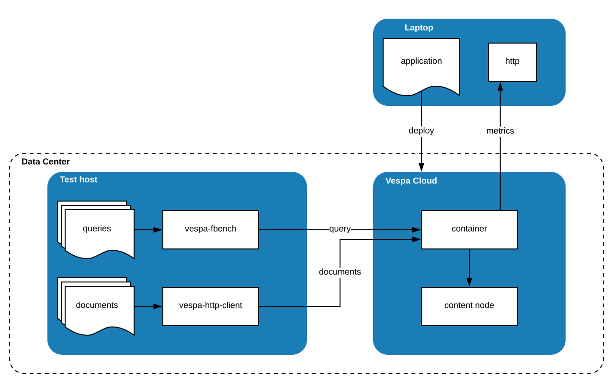

---
# Copyright 2020 Oath Inc. All rights reserved.
title: "Benchmarking"
---

Welcome to the step-by-step guide to get started benchmarking.
It is based on [Vespa Benchmarking](https://docs.vespa.ai/documentation/performance/vespa-benchmarking.html),
adding what is needed to benchmark using Vespa Cloud. Overview:

Notes:
* The application is deployed from anywhere, using the [control plane api key](security-model#control-plane).
* Query files should be available in the same data center as where production load originates -
or same zone as Vespa Cloud.
Documents are normally stored in same location as query files, but not necessarily.
Both need [data plane public and private key](security-model#data-plane) to access data in Vespa Cloud,
as well as getting metrics.

## Security - add and validate access
Refer to the [Vespa security model](/security-model#data-plane).
The user running benchmarks must have read access to the endpoint -
if the user already has it, skip this section. 

Add more public certificates to `/security/clients.pem`
in the application package by just cat'ing .pem files to `clients.pem` -
and then deploy the application package again.

Run a test query to test credentials - count all documents using schema _music_ - using POST:

    $ curl --cert data-plane-public-cert.pem --key data-plane-private-key.pem \
        -H "Content-Type: application/json" \
        --data '{"yql" : "select * from sources * where sddocname contains \"music\";"}' \
        https://myapp.mytenant.aws-us-east-1c.public.vespa.oath.cloud/search/

Equivalent, using GET:

    $ curl --cert data-plane-public-cert.pem --key data-plane-private-key.pem \
        https://myapp.mytenant.aws-us-east-1c.public.vespa.oath.cloud/search/?yql=select%20%2A%20from%20sources%20%2A%20where%20sddocname%20contains%20%22music%22%3B%0A

Make sure the response is a proper Vespa query response - minimal example:

    {"root":{"id":"toplevel","relevance":1.0,"fields":{"totalCount":0},"coverage":{"coverage":100,"documents":0,"full":true,"nodes":2,"results":1,"resultsFull":1}}}

Feed documents:

    $ docker run -v $(pwd):/files -w /files --entrypoint '' vespaengine/vespa \
        /usr/bin/java -jar /opt/vespa/lib/jars/vespa-http-client-jar-with-dependencies.jar \
          --useTls --caCertificates /etc/ssl/certs/ca-bundle.crt \
          --certificate data-plane-public-cert.pem --privateKey data-plane-private-key.pem \
          --file docs.json --endpoint https://myapp.mytenant.aws-us-east-1c.public.vespa.oath.cloud

Expected reponse:

    Thu Feb 13 14:05:44 UTC 2020 Result received: 0 (0 failed so far, 382 sent, success rate 0.00 docs/sec).
    Thu Feb 13 14:05:49 UTC 2020 Result received: 382 (0 failed so far, 382 sent, success rate 77.39 docs/sec).

## Test using vespa-fbench
Test a single query, using [vespa-fbench](https://docs.vespa.ai/documentation/reference/vespa-cmdline-tools.html#vespa-fbench) running in a docker container:

    $ ls -1 *.pem
      data-plane-private-key.pem
      data-plane-public-cert.pem

    $ cat query001.txt
      /search/?yql=select%20%2A%20from%20sources%20%2A%20where%20sddocname%20contains%20%22music%22%3B

    $ docker run -v $(pwd):/files -w /files --entrypoint '' vespaengine/vespa \
        /opt/vespa/bin/vespa-fbench \
          -C data-plane-public-cert.pem -K data-plane-private-key.pem -T /etc/ssl/certs/ca-bundle.crt \
          -n 1 -q query001.txt -s 1 -c 0 \
          myapp.mytenant.aws-us-east-1c.public.vespa.oath.cloud 443

    Starting clients...
    Stopping clients
    Clients stopped.
    .
    Clients Joined.
    *** HTTP keep-alive statistics ***
    connection reuse count -- 4
    ***************** Benchmark Summary *****************
    clients:                       1
    ran for:                       1 seconds
    cycle time:                    0 ms
    lower response limit:          0 bytes
    skipped requests:              0
    failed requests:               0
    successful requests:           5
    cycles not held:               5
    minimum response time:    128.17 ms
    maximum response time:    515.35 ms
    average response time:    206.38 ms
    25 percentile:            128.70 ms
    50 percentile:            129.60 ms
    75 percentile:            130.20 ms
    90 percentile:            361.32 ms
    95 percentile:            438.36 ms
    99 percentile:            499.99 ms
    actual query rate:          4.80 Q/s
    utilization:               99.03 %
    zero hit queries:              5
    http request status breakdown:
           200 :        5

Make sure there are no `SSL_do_handshake` errors in the output

## Run query from data center
At this point, it is verified that the benchmarking tool is able to push load to the application.

Next step is to run this from the same location (data center) as the clients are deployed in.
In this example, an AWS zone - see [zones](/reference/zones) - deduct AWS zone from Vespa Cloud zone name.
Below is an example using an AWS free-tier host with _Amazon Linux 2 AMI (HVM)_ image:

1. Create the host - here assume key pair is named _key.pem_.
No need to do anything other than default.

1. Log in, update, install docker
(guide courtesy of [Yevgeniy Brikman](https://www.ybrikman.com/writing/2015/11/11/running-docker-aws-ground-up/)):

       $ ssh -i key.pem ec2-user@ec2-xx-xxx-xxx-xxx.compute-1.amazonaws.com
       [ec2-user]$ sudo yum update -y
       [ec2-user]$ sudo yum install -y docker
       [ec2-user]$ sudo service docker start
       [ec2-user]$ sudo usermod -a -G docker ec2-user
       [ec2-user]$ exit

1. Copy keys to the host for endpoint access, log in and validate docker setup:

       $ scp -i key.pem data-plane-private-key.pem ec2-user@ec2-xx-xxx-xxx-xxx.compute-1.amazonaws.com:
       $ scp -i key.pem data-plane-public-cert.pem ec2-user@ec2-xx-xxx-xxx-xxx.compute-1.amazonaws.com:

       $ ssh -i key.pem ec2-user@ec2-xx-xxx-xxx-xxx.compute-1.amazonaws.com
       [ec2-user]$ docker info

1. Make a dummy query:

       [ec2-user]$ echo '/search/?yql=select%20%2A%20from%20sources%20%2A%20where%20sddocname%20contains%20%22doc%22%3B' > query001.txt

1. Run vespa-fbench and verify 200 response:

       [ec2-user]$ docker run -v $(pwd):/files -w /files --entrypoint '' vespaengine/vespa \
                     /opt/vespa/bin/vespa-fbench \
                       -C data-plane-public-cert.pem -K data-plane-private-key.pem -T /etc/ssl/certs/ca-bundle.crt \
                       -n 1 -q query001.txt -s 1 -c 0 \
                       myapp.mytenant.aws-us-east-1c.public.vespa.oath.cloud 443

## Run benchmark
Use the [Vespa Benchmarking Guide](https://docs.vespa.ai/documentation/performance/vespa-benchmarking.html) and
[Vespa Serving Scaling Guide](https://docs.vespa.ai/documentation/performance/sizing-search.html) to plan and run benchmarks.

Make sure the client running the becnhmark tool has sufficient resources (the example above used am AWS free-tier host).

### Metrics
Use _metrics/v2_ to dump metrics:

    $ curl --cert data-plane-public-cert.pem --key data-plane-private-key.pem \
        https://myapp.mytenant.aws-us-east-1c.dev.public.vespa.oath.cloud/metrics/v2/values | \
        jq '.nodes[] | select(.role=="content/mysearchcluster/0/0") | .node.metrics[].values'
