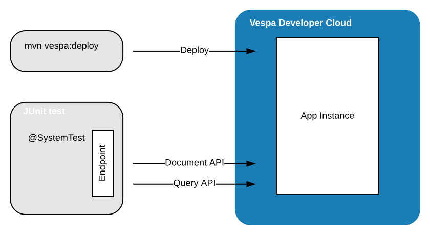
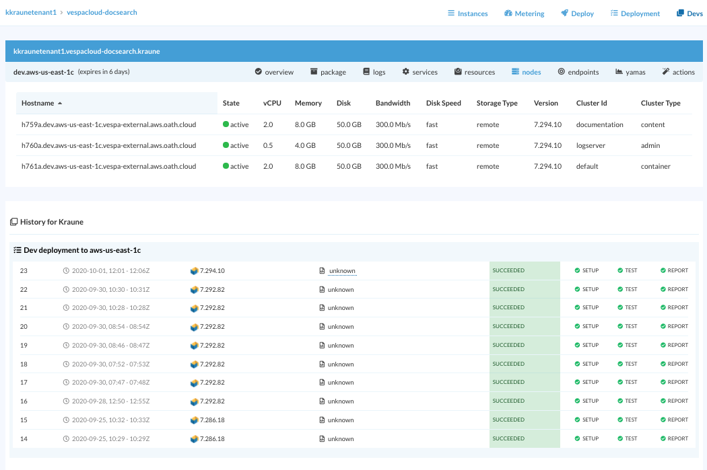

---
# Copyright Verizon Media. All rights reserved.
title: Developer Guide
---

Using the Developer Cloud is easy - deploy to it, and use the endpoints:

1. Build and deploy (e.g. using the [vespa-documentation-search](https://github.com/vespa-engine/sample-apps/tree/master/vespa-cloud/vespa-documentation-search)
sample application):

        $ mvn clean install package vespa:deploy -DapiKeyFile=/path-to/uname.tname.pem
        ...
        [INFO]     [11:18:30]  Found endpoints:
        [INFO]     [11:18:30]  - dev.aws-us-east-1c
        [INFO]     [11:18:30]  |-- https://uname.vespacloud-docsearch.tname.aws-us-east-1c.dev.public.vespa.oath.cloud/ (cluster 'default')
        [INFO]     [11:18:31]  Installation succeeded!

2. Query the endpoint(s):

        $ ENDPOINT=https://uname.vespacloud-docsearch.tname.aws-us-east-1c.dev.public.vespa.oath.cloud/
        $ curl --cert ./data-plane-public-cert.pem --key ./data-plane-private-key.pem ${ENDPOINT}document/v1/open/doc/docid/
    
Notes:
* The _User API key_ used to deploy the application to the Developer Cloud can be downloaded from the Console
  \- [key details](/security-model).
* The _Vespa API Certificate_ key/cert pair is used to access the endpoint(s).
  See the sample applications in [getting started](/getting-started) for how to generate key pairs.
  Endpoint(s) are printed by `vespa:deploy` and also found in the console in the _Devs_ section
* The [Vespa Cloud Sample Applications](https://github.com/vespa-engine/sample-apps/tree/master/vespa-cloud/)
  can be deployed as-is to your own Developer Cloud, and is a great starting point for application development.
* Applications are downscaled in the Developer Cloud - no need to change node counts in [services.xml](/reference/services) -
  applications are deployed with one node per cluster

## Application Development
Vespa Team recommends using a System Test to write code to access and test the endpoint,
in order to develop the application, like
[VespaDocSystemTest](https://github.com/vespa-engine/sample-apps/blob/master/vespa-cloud/vespa-documentation-search/src/test/java/ai/vespa/cloud/docsearch/VespaDocSystemTest.java).
This gets you started by feeding to and reading from an endpoint.
[Endpoint](https://github.com/vespa-engine/vespa/blob/master/tenant-cd-api/src/main/java/ai/vespa/hosted/cd/Endpoint.java)
is a class that defaults to a Developer Cloud Endpoint.
To submit applications to Production environments, use [automated deployments](/automated-deployments).
This means writing [System and Staging Tests](/reference/testing), so getting started with a System Test saves works.

### Pro tips / troubleshooting
* As Vespa Cloud upgrades daily, a deploy will some times pull the latest Vespa Version.
  This takes minutes as opposed to the seconds it normally takes.
  Start the day by deploying to avoid the wait!
* A common mistake is `pom.xml` mismatch. `tenant` and `application` is pulled from the pom -
  [details](/reference/vespa-cloud-api).
  Errors here cause a 401 when deploying
* Likewise for data plane -
  remember to copy the public sertificate to `src/main/application/security/clients.pem` before building and deploying.
* Set all keys in the IDE:
    
        -Dtest.categories=system
        -DapiKeyFile=/path-to/uname.tname.pem
        -DdataPlaneCertificateFile=/path-to/data-plane-public-cert.pem
        -DdataPlaneKeyFile=/path-to/data-plane-private-key.pem

  

## Vespa Cloud Console

