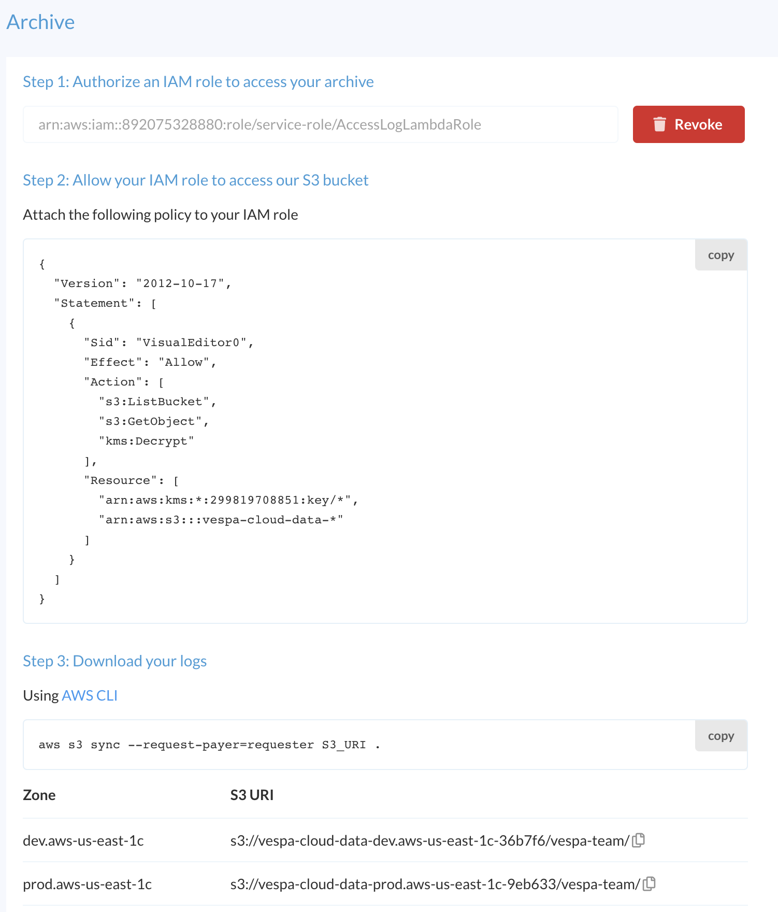

---
# Copyright Verizon Media. All rights reserved.
title: Archive guide
layout: page
---

Vespa Cloud exports log data to S3 buckets -
use this guide to list, download or process this data.



Assign roles and policies in the console.

Refer to [access-log-lambda](https://github.com/vespa-engine/sample-apps/blob/master/vespa-cloud/vespa-documentation-search/access-log-lambda/README.md)
for how to install and use `aws cli`, which can be used to download logs as in the illustration,
or e.g. list objects:

```
$ aws s3 ls --profile=archive --request-payer=requester \
  s3://vespa-cloud-data-prod.aws-us-east-1c-9eb633/vespa-team/

        PRE album-rec-searcher/
        PRE cord-19/
        PRE vespacloud-docsearch/
```

In the example above, the S3 bucket name is _vespa-cloud-data-prod.aws-us-east-1c-9eb633_
and the tenant name is _vespa-team_ (for that particular prod zone).
Archiving is per tenant, and a log file is normally stored with a key like:

    /vespa-team/vespacloud-docsearch/default/h2946a/logs/access/JsonAccessLog.default.20210629100001.zst

The URI to this object is hence:

    s3://vespa-cloud-data-prod.aws-us-east-1c-9eb633/vespa-team/vespacloud-docsearch/default/h2946a/logs/access/JsonAccessLog.default.20210629100001.zst

Objects are exported once generated - access log files are compressed and exported per hour.


## Lambda processing

When processing logs using a lambda function,
write a minimal function to list objects,
to sort out access / keys / roles:

```
const aws = require("aws-sdk");
const s3 = new aws.S3({ apiVersion: "2006-03-01" });

const findRelevantKeys = ({ Bucket, Prefix }) => {
  console.log(`Finding relevant keys in bucket ${Bucket}`);
  return s3
    .listObjectsV2({ Bucket: Bucket, Prefix: Prefix, RequestPayer: "requester" })
    .promise()
    .then((res) =>
      res.Contents.map((content) => ({ Bucket, Key: content.Key }))
    )
    .catch((err) => Error(err));
};

exports.handler = async (event, context) => {
  const options = { Bucket: "vespa-cloud-data-prod.aws-us-east-1c-9eb633", Prefix: "MY-TENANT-NAME/" };
  return findRelevantKeys(options)
    .then((res) => {
      console.log("response: ", res);
      return { statusCode: 200 };
    })
    .catch((err) => ({ statusCode: 500, message: err }));
};
```

Note: Always set `RequestPayer: "requester"` to access the objects -
transfer cost is assigned to the requester.

Once the above lists the log files from S3,
review [access-log-lambda](https://github.com/vespa-engine/sample-apps/blob/master/vespa-cloud/vespa-documentation-search/access-log-lambda/README.md)
for how to write a function to decompress and handle the log data.
