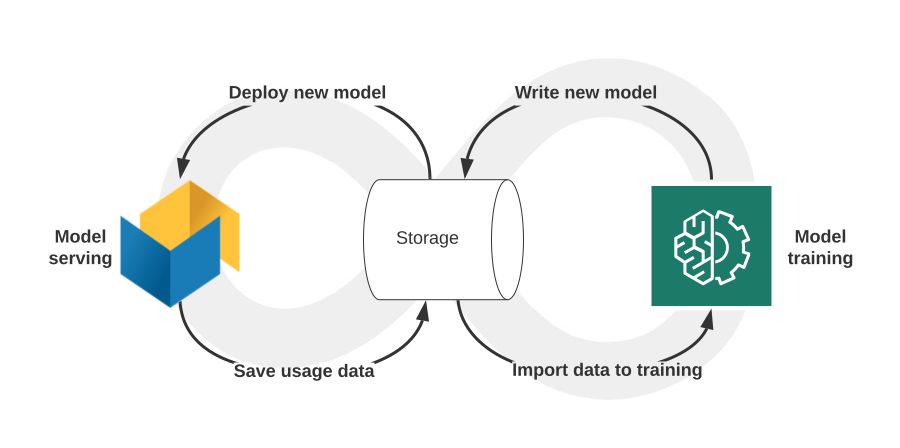
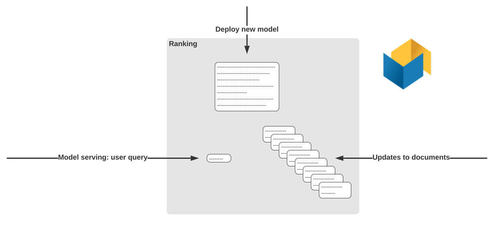
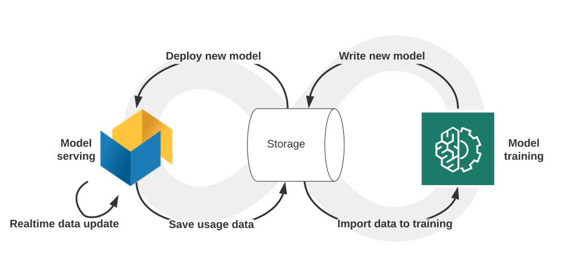

---
# Copyright Verizon Media. All rights reserved.
title: "Model Serving"
---

[The Big Data Maturity Levels](https://blog.vespa.ai/the-big-data-maturity-levels/)
defines the road to _automated data-driven decisions online_. 
Consider an application where the model training and serving is fully automated:

Signals from the serving system (e.g. usage data) is fed back to model training,
and new model generations are deployed to serving:
* [Deploy](https://docs.vespa.ai/documentation/cloudconfig/application-packages.html#deploy)
  deploys a new model generation for serving
* [Grid logging](https://docs.vespa.ai/documentation/feed-using-hadoop-pig-oozie.html)
  and [custom plugins](https://docs.vespa.ai/documentation/searcher-development.html)
  export data for use in subsequent training iterations

This is _automated_ data-driven decisions, but it is not _online_.
A training cycle normally takes hours / days.

## Online
To make online decisions, model serving must use realtime queries and signals.
This excludes updating the trained model itself, the loop is too long.
Zooming in on the left side of the illustration:

As the application is used, data is fed to it in real time by updating documents. Example:
_A user completed listening to a song._
_Update document(s) that tracks the user's history._
_Use the updated history when recommending or auto-playing the next song._

Note the realtime updating cycle bottom left above -
online means storing and using the updated data for next operation.

Another important aspect of online decisions is the ability to submit realtime signals with the query.
In the above example, a user might be playing songs from a given genre,
but other factors like time of day, location, device, could be relevant for the decisions,
and can be submitted with the query - as well as filters that limits the candidate set.

It is generally impossible to pre-process all alternatives.
Applications might simplify by using categorizations,
i.e. downsampling data, trading off precision and hence quality.
Online decisions eliminates all this,
and is often cheaper as only the used decisions are calculated.  

## Ranking
Model serving in Vespa is [ranking](https://docs.vespa.ai/documentation/ranking.html).
Ranking is a function that computes a score per document and ranks documents by score.
In short, just mathematics and hence fully flexible for most applications needs.

In Vespa, models can be represented using [tensors](https://docs.vespa.ai/documentation/tensor-user-guide.html).
A tensor is a multi-dimensional data structure with numbers.
Ranking is hence running the rank function using the model, data and query tensors.

Vespa distributes data and queries over a set nodes.
This makes ranking scalable to web-scale applications with update rates in tens of thousands
and latencies in milliseconds.

## Next reads
Applications with use cases like Recommendation, Search and Prediction,
and strong throughput/latency/data size requirements should evaluate Vespa by reading
* [Ranking](https://docs.vespa.ai/documentation/ranking.html)
* [Writing](https://docs.vespa.ai/documentation/writing-to-vespa.html)
* [Querying](https://docs.vespa.ai/documentation/querying-vespa.html)
* [Performance](https://docs.vespa.ai/documentation/performance)

Use this site to explore subjects like Security and Automation using Vespa Cloud.